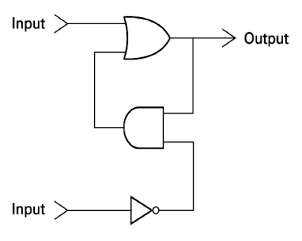

# Atividade 2 - Representação da Informação

## Aluno: Steffano Xavier Pereira

### Qual é a sequência binária que representa o seu primeiro nome em ASCII de 8 bits? Por exemplo, se o seu nome for Hello, a sequência binária será: 01001000 01100101 01101100 01101100 01101111. Use a tabela ASCII de 8 bits fornecida na aula para ajudar na elaboração da resposta

Primeiro devemos determinar quais são os valores binários para cada caractere de meu nome (nesse caso para Steffano vamos ter o conjunto de caracteres `{S, t, e, f, a, n, o}`). Vale lembrar que a tabela ASCII separa em caracteres, maiúsculos e minúsculos, então para a primeira letra será usado o `S` maiúsculo e do restante será minúsculo, logo:

| Caractere | Valor Binário |
| --------- | ------------- |
|     S     |    01010011   |
|     t     |    01110100   |
|     e     |    01100101   |
|     f     |    01100110   |
|     a     |    01100001   |
|     n     |    01101110   |
|     o     |    01101111   |

Dessa forma, para montar o nome `Steffano`, teremos o seguinte:

|    S     |     t    |    e     |     f    |     f    |     a    |     n    |     o    |
|:--------:|:--------:|:--------:|:--------:|:--------:|:--------:|:--------:|:--------:|
| 01010011 | 01110100 | 01100101 | 01100110 | 01100110 | 01100001 | 01101110 | 01101111 |

---

### Considere que o dígito a é o último dígito binário da primeira letra do seu nome e o dígito b é o último dígito da última letra do seu nome (considerando a mesma sequência binária da questão 1). Por exemplo, se o seu nome for Hello (0100100**0** 01100101 01101100 01101100 0110111**1**), a = 0 e b = 1. Indique o resultado das alternativas

Para essa pergunta os valores de **a** e **b** são `1` e `1` respectivamente. Logo, para:

1. a **AND** b = 1
2. a **OR** b = 1
3. a **XOR** b = 0
4. **NOT** b = 0

---

### Considerando os mesmos valores binários relacionados com os símbolos a e b da questão 2, forneça a saída/output do circuito abaixo caso forem colocados na entrada superior o valor de a e na entrada inferior o valor de b

Logo, considerando a = 1 e b = 1, logo o _output_ deverá ser o valor 1. Na realidade, o _output_ desse circuito pode ser simplificado apenas para o valor do _input_ superior, nesse caso seria o valor de a, pois o _input_ inferior é indiferente para o resultado da operação, visto que o operador lógico **AND** é totalmente dependente do valor do _input_ superior, do qual esse **AND** é indiferente para o operador **OR**, no qual o _input_ superior será o determinante para o _output_.

---

### Considerando os valores de a e b da questão 2, faça uma pesquisa sobre um dos temas da tabela abaixo, fornecendo um texto com o resumo da pesquisa contendo de 1 a 2 páginas (use fonte Arial 12)

Para a = 1 e b = 1, teremos o seguinte Tema: _Como é a representação de vídeo no computador_

Uma imagem digitalizada é dividida em vários pixels. Cada um destes pixels é
representado por número extraído de um conjunto finito predefinido e cada número destes é constituído por diferentes sequências de 1’s e 0’s. Quanto maior for a quantidade de pixels de uma imagem maior será a quantidade de números, maior será a quantidade de 1’s e 0’s e consequentemente maior será a quantidade de bits necessários para enviá-la ou armazená-la.

Um vídeo nada mais é do que uma sequência de imagens estáticas. Agora, se cada pixel de uma imagem e cada imagem de um vídeo for digitalizada desta maneira será gerado um imenso arquivo. Para a realização da captura de sinais de vídeo, os sinais gerados por câmeras são digitalizados. A tela de uma televisão comum geralmente tem 640x480 pixels, ou seja, 307200 pixels. No caso de um simples vídeo em preto e branco, com 256 níveis de cinza (o que equivale a dizer que cada pixel pode assumir um valor entre 0 e 255, ou seja, cada pixel tem 8 bits ou 1 byte), com 10 segundos de duração, a uma taxa de exibição de 30 fps (quadros por segundo), teria 737280000 bits, ou seja, mais de 737Mbits, que por sua vez é mais de 92 Mbytes. Um codificador busca exatamente reduzir este tamanho, chegando a fazê-lo em mais de 100 vezes. Por isto o estudo em técnicas de compressão vem sendo intensificado cada vez mais.

A taxa de bits é o principal parâmetro relacionado à qualidade do som e da imagem do arquivo codificado. É ele que define o tamanho do arquivo final. Numa seqüência de vídeo, por exemplo, a taxa de 1 kbit/s (um kilobit por segundo) significa que cada segundo do arquivo codificado vai ter 1000 bits. Ou seja, se um vídeo tiver 64 segundos, o arquivo vai ter 64 kbits, ou 8 kbytes. Quanto maior for a bitrate, maior será a qualidade do vídeo, mas também será maior o seu tamanho. O MPEG-2 Layer 3 (ou MP3, como é mais conhecido) é um codificador de áudio bem popular e geralmente é usada a taxa de 128 kbits/s para a codificação de músicas, que é a menor taxa para que o arquivo final fique com boa qualidade.

A Representação de vídeo é a primeira e um dos mais importantes sub-problemas no processamento de vídeo. Uma boa representação deve incluir o ponto chave e informação útil para discriminação enquanto descarta informações desnecessárias.

Um sistema de redução de taxa de bits remove a informação redundante
do sinal antes de ser transmitido pelo codificador, e reintroduz
essa informação depois no descodificador. Um par codificador
e descodificador é referido como um "CODEC". Nos sinais video,
são conhecidas duas classes de redundancia.

Na Redundancia espacial e temporal os valores dos pixels não são independentes, mas estão correlacionados com os seus vizinhos ambos com a mesma frame e contra frames. Então, por alguma extensão, o valor do pixel é previsível tomando os valores dos pixels vizinhos.

Na Redundancia Psicovisual o olho humano tem uma resposta limitada para os detalhes espaciais, e é menos sensivel para detalhes de bordes cercanos ou mudanças impulsionais. Consequentemente, o deterioro controlado na imagem descodificada, introduzido pelo processo de redução da taxa de bits, pode não ser visivel pelo observador humano.

Os padrões MPEG e seus algoritmos foram desenvolvidos por uma equipe internacional de especialistas. Seus arquivos são pequenos e, de uma forma geral, de boa qualidade. Por ser um padrão internacional e aberto, é usado na maioria das máquinas. Além disto, existe uma grande quantidade de arquivos MPEG disponíveis na Internet. Vários equipamentos de hardware, como placas gráficas e de vídeo de diversos fabricantes e diversos sistemas operacionais como o Windows 95, Windows NT e Macintosh OS suportam o MPEG. O padrão MPEG-1, por exemplo, funciona em 90% das máquinas.
