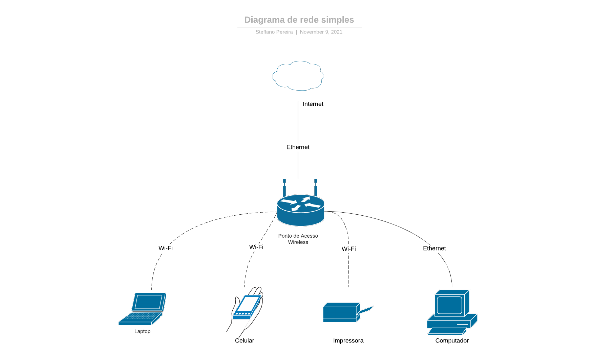

# Atividade 7 - Redes de Computadores e Internet

## Aluno: Steffano Xavier Pereira

### 1) De acordo com a definição de redes apresentada nas aulas, informe se as situações seguintes correspondem a cenários de rede, justificando a sua resposta: (a) considerando sua TV e o controle remoto como dois dispositivos, há um ambiente de rede? (b) considerando várias pessoas na sua casa acessando a Internet por meio de Wifi, há um ambiente de rede?

a. Sim, podemos considerar que há um ambiente de rede; ambos os dispositivos estão configurados dentro de uma malha de rede que se comunica por meio de um protocolo, de tal forma que consegue estabelecer uma comunicação entre si (nesse caso por meio da tecnologia de comunicação infravermelho). Logo, há um ambiente de rede que conecta ambos os dispositivos as suas devidas funções.

b. Sim, há um ambiente de rede que está conectada a um gateway que dá acesso a uma rede de internet, visto que todas as pessoas na casa estão acessando por meio de ondas de rádio um mesmo aparelho que faz a conversão e que _administra_ a rede da casa, garantindo que o dispositivo de rádio sob protocolo WiFi dessas pessoas possa ter acesso a internet.

---

### 2) Escolha dois tipos diferentes de redes em termos de tecnologias e faça um diagrama esquemático dos principais elementos de hardware presentes em uma comunicação

O seguinte diagrama, corresponde ao diagrama de rede da minha casa, nele há dois tipos de tecnologias sendo ressaltadas, que é o **WiFi** e também a tecnologia **Ethernet**. Para essa rede, podemos separar em dois níveis de acesso, o acesso entre a internet e o roteador (que também é um ponto de acesso wireless), esse acesso se trata do acesso entre meu provedor de internet e a minha casa, nesse caso a comunicação é feita por meio de um cabo sobre a tecnologia **ethernet**, mais especificamente por meio de um cabo **UTP Cat 5e**. Ao chegar no roteador/modem de minha casa, este cria uma nova rede, que pode ser considerado como a minha LAN e que irá fazer o roteamento dos dispositivos que querem ter acesso a internet, dentro de minha casa. Há duas formas de realizar isso, por meio da Tecnologia de rádio sem fio **WiFi** e também por meio da tecnologia por cabo **Ethernet**. Por **WiFi**, os dispositivos laptop, celular e impressora conseguem acesso a rede interna **LAN** por meio de ondas de rádio, cada dispositivo que se comunica por essa tecnologia, possuí uma placa de rede com uma antena que envia as informações por meio de radiodifusão. Já para os dispositivos conectados por meio da tecnologia **Ethernet**, sua conexão é feita por meio de um cabo que envia sinais elétricos entre duas placas de rede, através de fios de cobre e conectores, possibilitando a conexão do computador a internet. Dessa forma temos um diagrama de rede simples.

---

### 3) As redes podem ser classificadas de acordo com a escala, topologia e tipo de transmissão. Na sua opinião, o tipo de rede sob a ótica de um tipo de classificação pode influenciar as demais classificações. Por exemplo, o fato de uma rede ser de longa distância pode influenciar a topologia e o tipo de transmissão? Para ajudar na sua resposta, é possível escolher outros exemplos, sempre justificando o seu ponto de vista

Com toda certeza, tome por exemplo, a fibra óptica: A fibra óptica é uma tecnologia mais recente e que está sendo implementada em larga escala para conexões a longas distâncias, suponha que queremos conectar dois continentes a mesma rede, ou nesse caso, a internet; a fibra óptica nesse caso é uma ótima opção para fazer esse tipo de conexão, pois consegue implementar uma alta velocidade de transmissão no mesmo meio e é pouco suscetível a atenuações se comparado as tecnologias baseadas em sinais elétricos. A Fibra óptica, por sua vez, é uma tecnologia cara, pois para o manuseio de ondas de luz e também das suas refrações requerem um custo elevado, principalmente se quisermos realizar diversas conexões, a exemplo a tecnologia de malha seria bastante custosa, dessa forma, a fibra óptica não seria uma boa opção de ser implementada em um ecossistema que necessita de bastante conexões de rede, por exemplo, o escritório de uma empresa que precisa de diversas conexões nos mais diversos locais, então para fazer todas essas conexões, todo tipo de rede há uma necessidade da topologia, o pensamento é de que se precisamos da topologia `X` e o tipo de transmissão precisa ser do tipo `Y`, para uma escala `Z`; o especialista de rede deve se adequar esse pensamento, para que ele possa encontrar uma tecnologia que satisfaça ao máximo possível as necessidades `XYZ`.]

---

### 4) Qual a principal utilidade em considerar uma arquitetura do software da rede em camadas, incluindo o conceito de serviços, interfaces e protocolos?

Em si, principalmente pela organização e padronização das arquiteturas, cada camada dita uma função da rede, de tal forma que, separa as ideias de cada rede, tome por exemplo as camadas de Acesso a rede e Internet do padrão TCP/IP, essas duas camadas tem funções diferentes, a camada de Acesso a rede visa manter a conexão do dispositivo dentro de uma rede e a camada de Internet visa estabelecer um endereço na rede ao qual o dispositivo foi inserido, observe que a camada de acesso a rede irá se preocupar com um problema de _baixo nível_ se comparada a camada de _rede_, pois o acesso a rede se preocupa com o sistema físico de conexão e interfaceamento, enquanto a de rede se trata do endereçamento lógico do sistema de rede. Dessa forma, podemos separar em diversas camadas que se relacionam entre si, mas que possuem funções diferentes.

---

### 5) Reflita sobre alguma rede que você usa na sua casa ou já usou em algum espaço público. Em seguida, faça um texto técnico relacionando esta rede escolhida com as diversas questões abordadas na aula, como a tecnologia, elementos de hardware, tipo de transmissão, escala, topologia, etc

A rede da minha casa se trata uma rede de tecnologia WiFi, por sua vez é um meio de transmissão de ondas eletromagnéticas, que conecta meu celular a rede de internet que está sendo providenciada pelo meu gateway de rede, em escala, essa rede é limitada a 254 (netmask 255.255.255.0) dispositivos que podem ser conectados ao gateway em uma topologia estrela. O Gateway é constituído de duas antenas de 3 dBi que fazem a transmissão e recebimento dos dados, além disso o padrão WiFi opera sobre a frequência de 2.4 GHz sob segurança WPA2.

---
