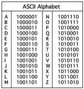

# 1ª Verificação de Aprendizagem

## Aluno: Steffano Xavier Pereira

### 1) Cada aluno possui um número mágico que é obtido pelo seguinte algoritmo simples

1. Defina a primeira letra do seu nome como L;
2. Obtenha a sequência binária S em ASCII da letra L;
3. Obtenha os 4 últimos dígitos da sequência S e converta para inteiro I;
4. Exiba o número inteiro I.

> Exemplo: Se L = “B”, S = “1000010” e I = 2.

Use a tabela abaixo e forneça os símbolos acima considerando o seu nome. Exiba o passo a passo detalhado.

### 2) Faça a divisão do número I encontrado na Questão 1 por 30 e exiba o resultado usando a notação IEEE 754. Exiba o passo a passo detalhado

### 3) O preço por bit de algum tipo de memória é obtido pela divisão do preço total do dispositivo pela capacidade de armazenamento. Por exemplo, se uma memória possui 1024 bits e custa na loja R$ 1024,00, o preço por bit é 1 R$/bit. Com base nessa explicação

1. acesse algum site de venda de equipamentos eletrônicos e obtenha o preço e a capacidade de pelo menos 2 tipos diferentes de memória (ex: HD, memória flash, etc);
2. Calcule o preço por bit para cada uma destas memórias;
3. Comente o resultado e explique qual a relação desse cálculo com o conceito de hierarquia de memória.

### 4) Qual a relação entre arquitetura e organização de computadores e sistemas operacionais? Para ilustrar a sua resposta, exemplifique alguma função do SO e sua relação com infraestrutura de hardware

### 5) O que são processos no contexto de sistemas operacionais? Descubra como a lista de processos pode ser exibida no sistema operacional do seu computador e forneça um print dos processos que estão em execução na sua máxima no momento da resolução desta prova
