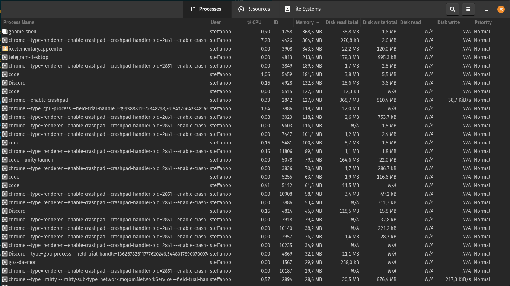

# 1ª Verificação de Aprendizagem

## Aluno: Steffano Xavier Pereira

### 1) Cada aluno possui um número mágico que é obtido pelo seguinte algoritmo simples

1. Defina a primeira letra do seu nome como L;

    Logo o valor de L deverá ser L = `S`.

2. Obtenha a sequência binária S em ASCII da letra L;

    Para a letra `S` deveremos ter o a sequência de bits: `1010011`

3. Obtenha os 4 últimos dígitos da sequência S e converta para inteiro I;

    Obtendo os 4 últimos digitos da sequência (`1010011`), teremos a seguinte sequência: `0011`.

    Para transformar em um valor inteiro devemos converter o valor binário em decimal, logo:

    | 2^3 | 2^2 | 2^1 | 2^0 |
    |:---:|:---:|:---:|:---:|
    |  0  |  0  |  1  |  1  |

    Dessa forma teremos que **I** será igual a `2^1 + 2^0`.

4. Exiba o número inteiro I.

    `I = 3`

> Exemplo: Se L = “B”, S = “1000010” e I = 2.

Use a tabela abaixo e forneça os símbolos acima considerando o seu nome. Exiba o passo a passo detalhado.


---

### 2) Faça a divisão do número I encontrado na Questão 1 por 30 e exiba o resultado usando a notação IEEE 754. Exiba o passo a passo detalhado

Inicialmente faremos o cálculo do valor resultante:

```m
3 / 30 = 0.1
```

Agora devemo passar para sua versão normalizada:

```m
0.1 = 0,000110011

0,000110011 = 1,10011 * 2^-4
```

Aplicando o padrão IEEE 754

|  Sinal  | Expoente | Mantissa |
|:-------:|:--------:|:--------:|
|Positivo |`-4 + 127`|1001100...|
|    0    | 01111011 |1001100...|

Logo, teremos o seguinte resultado no padrão IEEE 754:

```m
0.1 = 0 01111011 10011 000000000000000000

0.1 = 00111101110011000000000000000000
```

---

### 3) O preço por bit de algum tipo de memória é obtido pela divisão do preço total do dispositivo pela capacidade de armazenamento. Por exemplo, se uma memória possui 1024 bits e custa na loja R$ 1024,00, o preço por bit é 1 R$/bit. Com base nessa explicação

1. acesse algum site de venda de equipamentos eletrônicos e obtenha o preço e a capacidade de pelo menos 2 tipos diferentes de memória (ex: HD, memória flash, etc);

    - Memória RAM Crucial Ballistix 8GB DDR4 2666 Mhz
        - Capacidade de 8 GB de memória RAM (dinâmica)
        - Preço: R$ 259,90

    - SSD Kingston A400, 240GB, SATA,
        - Capacidade de 240 GB de memória ~~ROM~~
        - Preço: R$ 209,90

2. Calcule o preço por bit para cada uma destas memórias;

    Sinceramente, não me faz muito sentido transformar esse valores para bits, como ambos os valores foram dados em Gigabytes, vou utilizar os valores baseados em Gigabyte para análise

    - Memória RAM

        ```m
        259,90 / 8 = 32,4875

        R$ 32,4875 / gigabyte
        ```

        OU

        ```m
        8 GB = 68719476736 bits

        259,90 / 68719476736 = 3,7820428E-9

        R$ 3,7820428E-9 / bits
        ```

    - Memória de Estado Sólido (SSD)

        ```m
        209,90 / 240 ≃ 0,87458333

        R$ 0,87458333 / gigabyte
        ```

        OU

        ```m
        240 GB = 2061584302080

        R$ 1,0181490E-10 / bit
        ```

3. Comente o resultado e explique qual a relação desse cálculo com o conceito de hierarquia de memória.

    Podemos observar claramente a diferença entre as memórias RAM e memória externa, seguindo a hierarquia de memória, observamos que a memória RAM é uma memória mais custosa, que possuí menor capacidade, porém muito mais rápida se comparada com a memória de estado sólido, que é uma memória mais lenta e mais barata, neste caso custando cerca de 31 reais / gigabyte mais barato do que a memória RAM, sua função é armazenar dados permanentemente, enquanto a memória RAM é uma memória volátil.

---

### 4) Qual a relação entre arquitetura e organização de computadores e sistemas operacionais? Para ilustrar a sua resposta, exemplifique alguma função do SO e sua relação com infraestrutura de hardware

Estão totalmente relacionados entre si, principalmente com a imensidão de fabricantes de computadores nos dias atuais, por sua vez, os sistemas operacionais devem estar preparados para os mais diferentes tipos de hardware, em especial, o kernel é responsável por essa função; todavia para o kernel desempenhar suas funções é necessário ter algum padrão de comportamento de hardware, nesse momento entra a arquitetura e organização de computadores, pois, atualmente há um padrão para essa arquitetura, de tal forma que, esse padrão possibilita a comunicação entre diversos tipos de hardware de fabricantes distintas a comunicarem entre si.

A explicação anterior segue de software para hardware, mas historicamente, as necessidades começaram a partir do hardware até o software; quando os computadores começaram a ser inventados haviam diversos tipos de computadores, com hardwares distintos, e uma necessidade única: Como podemos popularizar o uso do computador? E a solução foi de manter uma arquitetura única, ou algumas poucas arquiteturas, como a arquitetura de processadores Intel e AMD; para que assim, empresas pudessem fabricar componentes e que computadores pessoais pudessem ser montados seguindo os mesmos padrões para que possa existir a socialização do espaço virtual, como enviar um arquivo de texto de um computador a outro. Dessa forma, houve a necessidade de existir sistemas operacionais que pudessem interfacear com os componentes eletro-eletrônicos.

A melhor função, já aqui representada, é a função do kernel, que realiza a alocação dos recursos de hardware para um dado processo.

---

### 5) O que são processos no contexto de sistemas operacionais? Descubra como a lista de processos pode ser exibida no sistema operacional do seu computador e forneça um print dos processos que estão em execução na sua máxima no momento da resolução desta prova

Cada processo em execução se refere a atividade de um programa, os processos em si são uma forma do sistema operacional gerenciar e alocar recursos, por meio do kernel, de hardware paras as necessidades do software ou processo em questão, pois cada programa poderá haver diversos processos com suas requisições de recursos para sua operação.

Por meio do meu sistema operacional, baseado na interface Gnome, basta procurar pelo System Monitor, ou pelo seguinte comando:

```bash
gnome-system-monitor
```

Algum dos processos que podem ser visualizados nessa etapa, são os seguintes:



---
