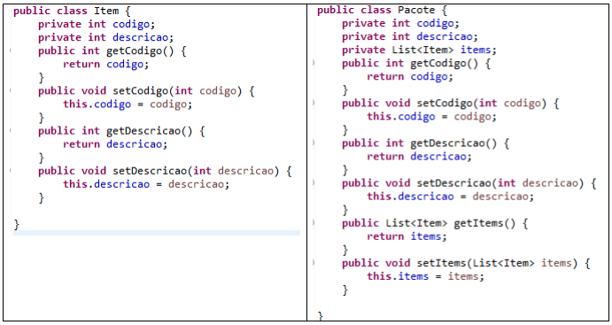

# 2ª Verificação de Aprendizagem

## Aluno: Steffano Xavier Pereira

### 1) A solução da prova deve iniciar com a descoberta da sua senha de prova. A senha é um número que é obtido por meio do seguinte código Java

```java
public class Senha {
    public static void main(String[] args) {
        String nome = "Danilo"; //Substitua pelo seu primeiro nome (não use acentos)
        int senha = (int)nome.toUpperCase().charAt(0) - 64;
        senha = senha/8;
        senha++;
        System.out.println(senha);
    }
}
```

Modifique o seu nome na segunda linha e execute este código na IDE Eclipse. Forneça qual foi a senha obtida como resposta desta questão.

Responda as demais questões com base no valor da sua senha:

|Senha|Questões a serem resolvidas|
|-----|---------------------------|
| 1   | 1,2,4,6                   |
| 2   | 1,3,5,7                   |
| 3   | 1,2,5,7                   |
| 4   | 1,3,4,6                   |

**Para o nome `Steffano` nós teremos `senha = 3`.**

---

### 2) Qual a relação entre a cobertura/abrangência geográfica de uma rede e os outros aspectos técnicos da rede como a tecnologia de transmissão? Justifique sua resposta.

Cada tecnologia de transmissão possuí uma característica técnica quanto a sua cobertura geográfica de transmissão para se manter uma rede. Observe a tecnologia de transmissão de rede WiFi, em si, essa tecnologia é um padrão técnico para transmissão de informação por meio de ondas de rádio; é uma tecnologia interessante quando queremos tornar uma rede independente de cabos e fios; todavia, devido a próprias propriedades do meio eletromagnético, que pode causar atenuações, ruídos e outras causas que afetam a eficiência dessa tecnologia de transmissão. Em si uma rede de WiFi residencial hoje pode atingir até cerca de 50/100 metros em ambiente controlado.

Agora se a nossa pretensão é ter uma rede focada em atingir uma alta distância ou abrangência maior dessa rede entre dois pontos, podemos optar por uma tecnologia de fibra óptica, que poderá transmitir um sinal por quilômetros de distância.

Então, cada tecnologia de rede é pensada para as mais diversas necessidades do meio do qual ela será inserida, por isso é necessário um técnico/engenheiro de redes para a constituição das redes de dispositivos. Dessa forma, a cobertura/abrangência geográfica é um aspecto importante na constituição de uma rede.

---

### 5) Classifique a linguagem de programação Java com relação ao modelo de tradução (compilação vs. interpretação) e com relação ao paradigma de programação da linguagem. Justifique/argumente sempre que necessário.

Essencialmente, a linguagem **Java** foi projetada para ser uma linguagem de programação orientada a objetos, logo está voltada ao paradigma de orientação a objetos. Todavia, as versões mais recentes dessa linguagem também abordam outros paradigmas importantes, como o paradigma funcional. Fato é que, Java é uma linguagem de programação que é traduzida para o modelo de **interpretação**, do qual é interpretado pelo que chamamos de _Java Virtual Machine (JVM)_ que seria a máquina virtual da plataforma Java. Se trata, por sua vez do ambiente de execução dessa linguagem de programação, isso facilita por exemplo, a execução de programas nos mais diversos sistemas de software, bastando que o sistema operacional possa executar o JVM para que os códigos da plataforma Java funcionem.

O Modelo de interpretação aqui é importante, para garantir a compatibilidade com a Máquina Virtual Java, permitindo ao programador Java se preocupar menos com operabilidade do seu programa com um Sistema Operacional específico, e apenas se preocupar com as diretivas da máquina virtual Java, possibilitando um foco maior nas ferramentas que o JVM proporciona.

---

### 7) Observe as listagens de classes abaixo e indique/explique em qual parte deste código Java é usado o conceito de composição e encapsulamento. Observação: isole a linha/palavra que corresponde a cada conceito, separadamente.

Na primeira imagem nós temos a classe de um objeto chamado de `Item`, esse objeto é utilizado pela classe do objeto `Pacote` através da Lista (`List`) `items`, nesse caso, composta por objetos do tipo `Item`. Podemos observar isto na linha 4 da 2ª imagem:

```java
private List<Item> items;
```



Observe que o encapsulamento é realizado pela Lista que se apropria dos objetos `Item` e delega cada objeto dentro de uma lista. Caso queiramos acessar os atributos e métodos de `Item`, isso seria possível, desde que um método trate cada `Item` dentro da lista `items`, de tal forma que poderia observar os atributos e métodos públicos que podem ser herdados do objeto `Item`.

Quanto a composição, podemos observar que o `Pacote` depende do `Item` como sua classe, logo `Item` se torna uma dependência do objeto `Pacote`, no qual compõe esse objeto, principalmente pelo fato da lista ser composta por objetos do tipo `Item`.

---
